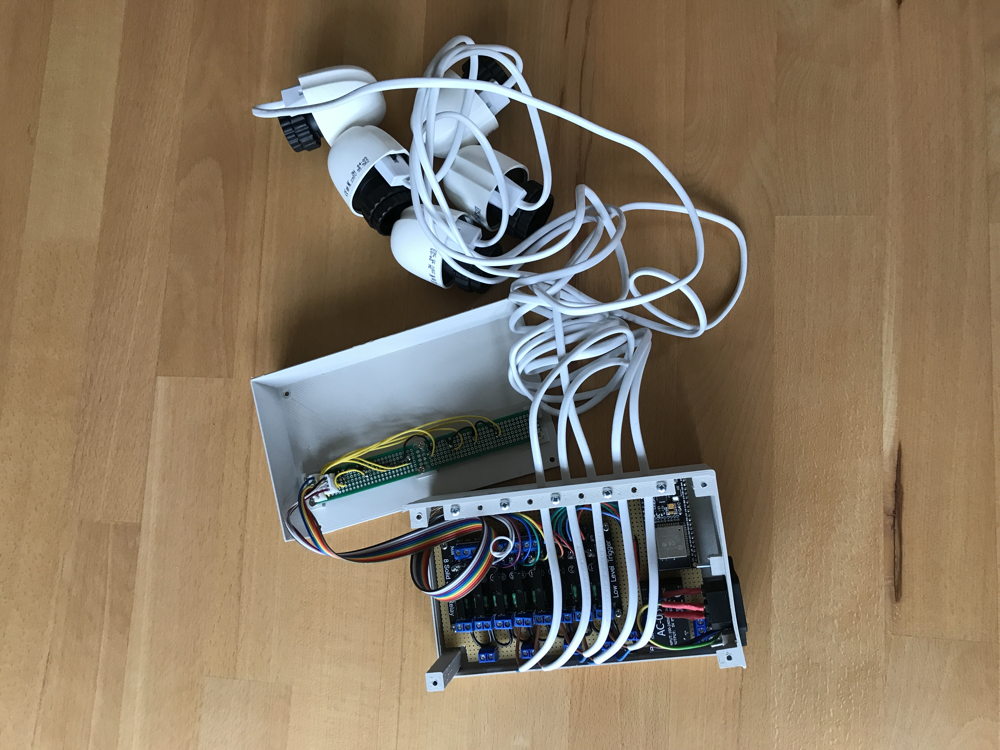
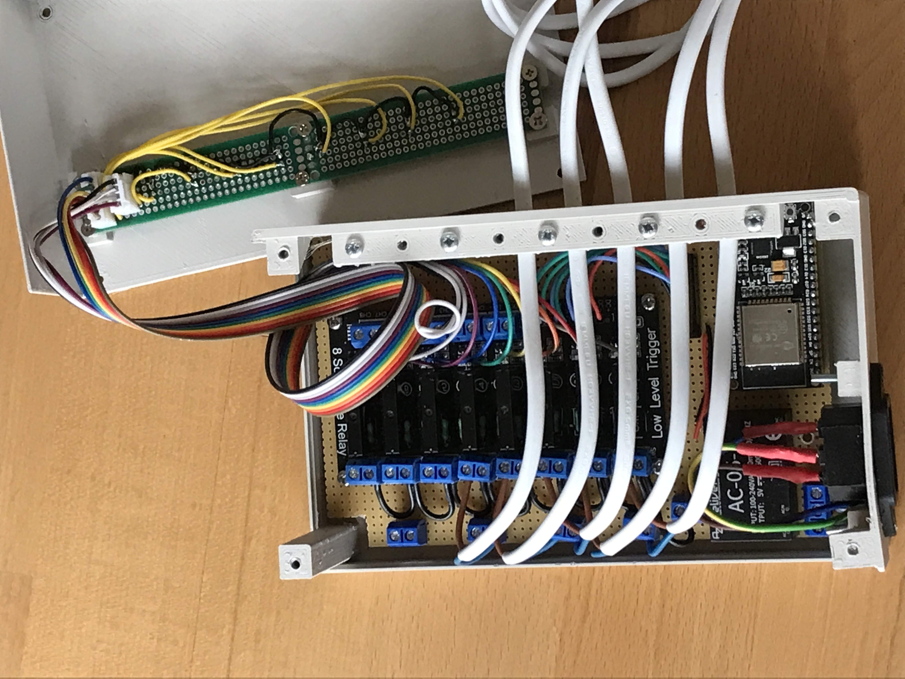
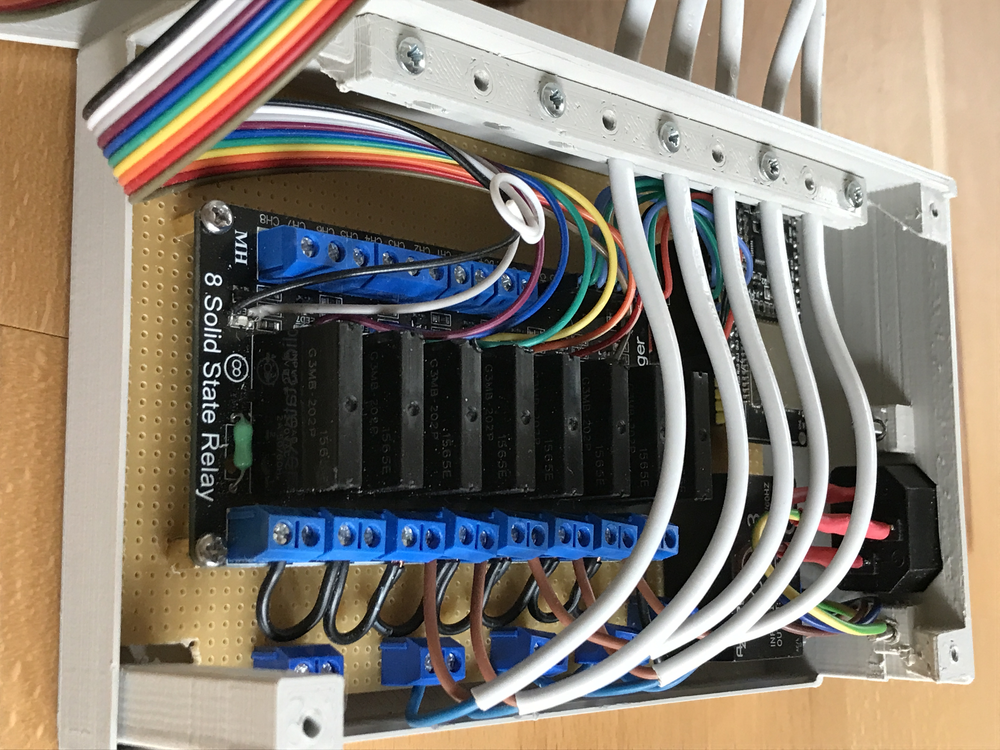
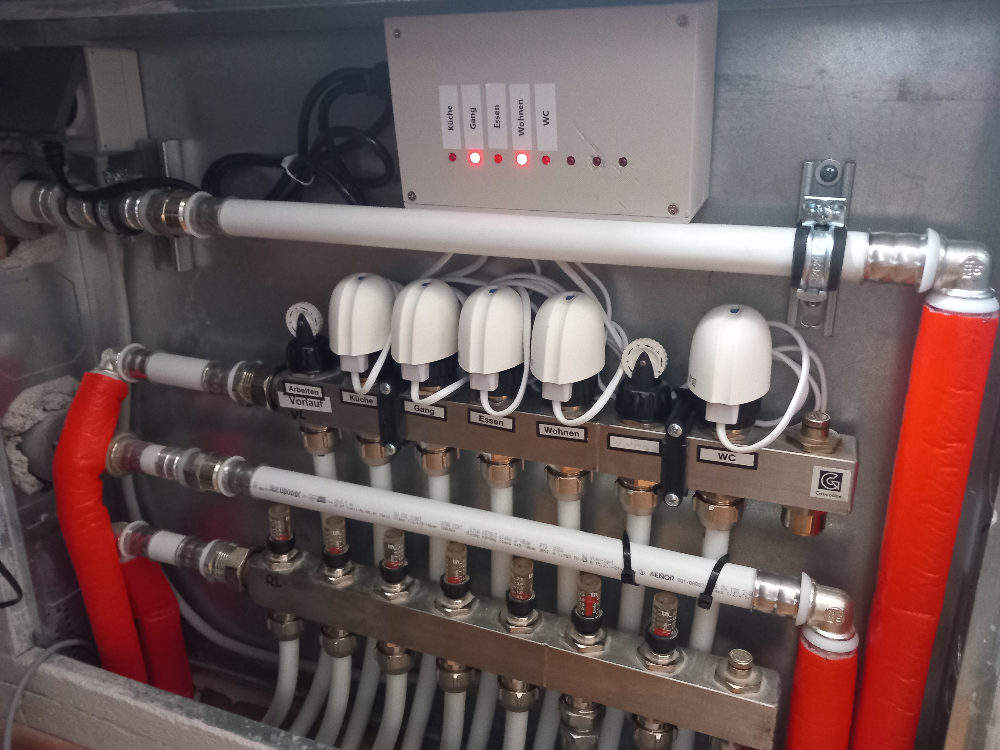

# ESP32 Heating Relay Module

A lightweight firmware to switch heating circuits per room using an ESP32 microcontroller plus an 8‑channel solid state relay board. It pairs with separate temperature sensors (other SmartHomeTS nodes) and listens for per‑room ON/OFF commands over MQTT.

---

## What It Does

1. Connects to Wi‑Fi (tries multiple SSIDs from an env variable).
2. Obtains its logical name via MQTT.
3. Receives a JSON config that maps room names → relay numbers (1–8).
4. Listens for `commands/Heating/<Room>` messages (`ON` / `OFF`).
5. Drives the corresponding relay (active LOW).
6. Can receive an OTA firmware update trigger.

---

## Hardware

| Item | Notes |
|------|-------|
| ESP32 DevKit v4 | MCU |
| 8‑Channel SSR Board | <https://www.az-delivery.de/en/products/8-kanal-solid-state-relais> |
| 3D Printed Case | <https://github.com/tschissler/SmartHomeTS/tree/main/3DModels/RelaisModule> |

---

## Images

