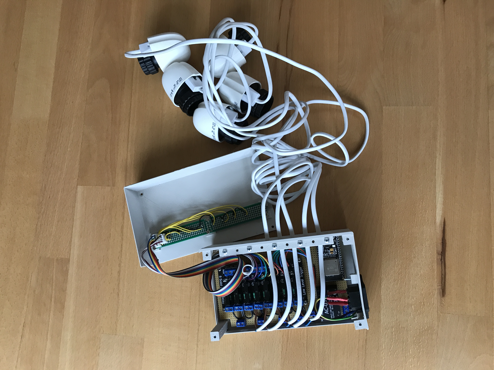
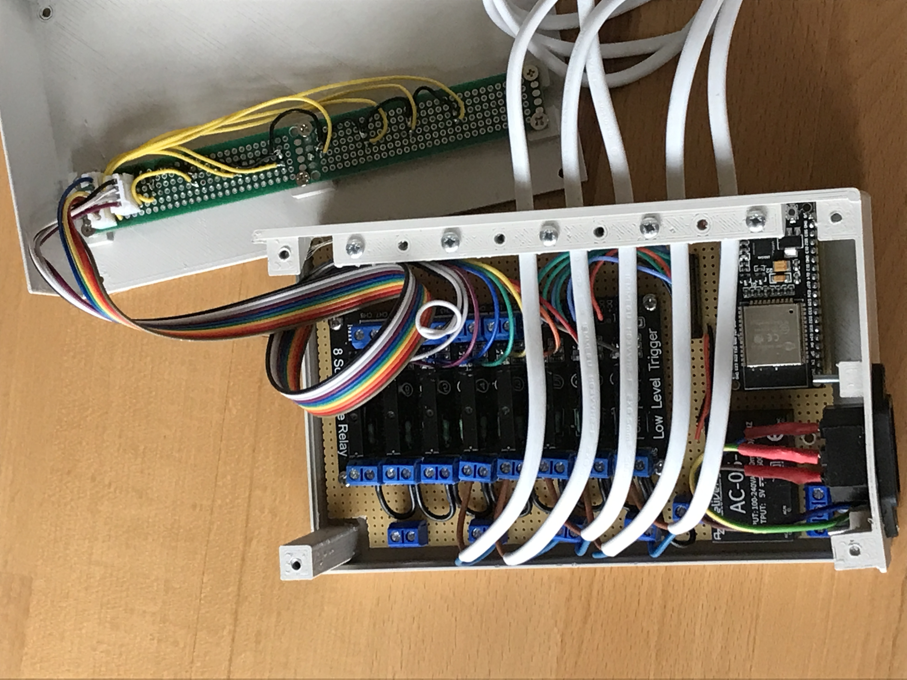
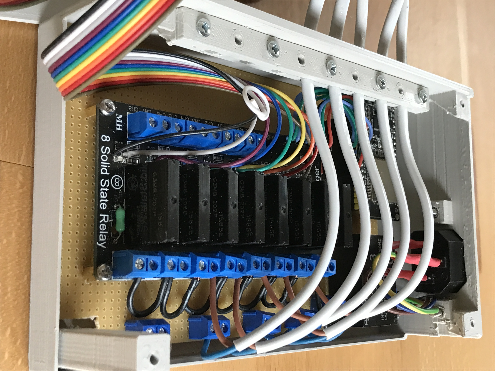
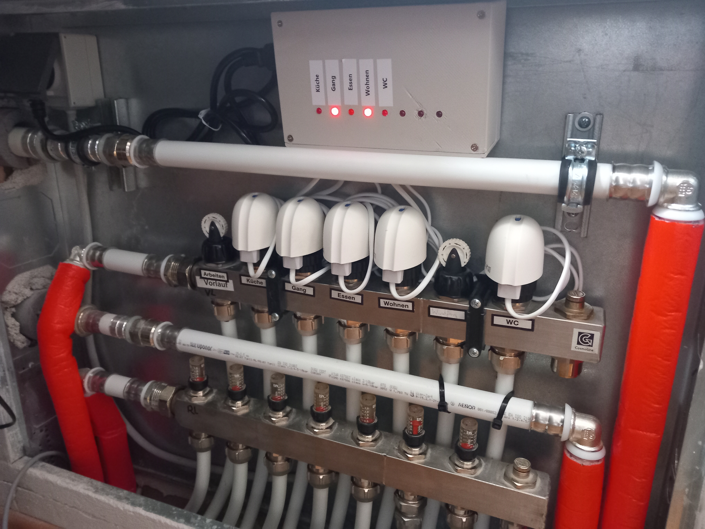
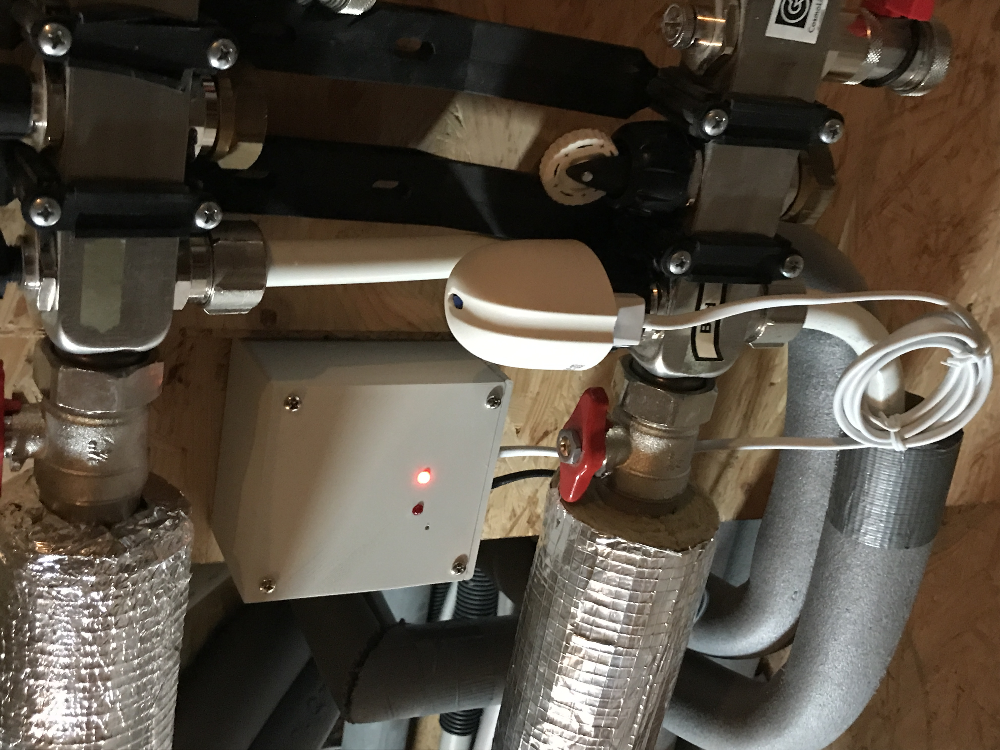

# ESP32 Heating Relay Module

A lightweight firmware to switch heating circuits per room using an ESP32 microcontroller plus an 8‑channel solid state relay board. It pairs with separate temperature sensors (other SmartHomeTS nodes) and listens for per‑room ON/OFF commands over MQTT.

---

## What It Does

1. Connects to Wi‑Fi (tries multiple SSIDs from an env variable).
2. Obtains its logical name via MQTT.
3. Receives a JSON config that maps room names → relay numbers (1–8).
4. Listens for `commands/Heating/<Room>` messages (`ON` / `OFF`).
5. Drives the corresponding relay (active LOW).
6. Publishes a status heartbeat and can receive an OTA firmware update trigger.

---

## MQTT Topics

| Topic | Direction | Notes |
|-------|-----------|-------|
| `config/Relaismodule/Sensorname/<chipId>` | in | Retained, logical device name |
| `config/Relaismodule/<name>/Relais` | in | Retained, JSON array of `{"Room","Pin"}` |
| `commands/Heating/#` | in | `ON` / `OFF` per room |
| `OTAUpdate/Relaismodule` | in | Firmware URL |
| `daten/Heizung/<location>/FussbodenHeizungSteuerung<Room>` | out | Retained relay state |
| `meta/<name>/version/RelaisModule` | out | Retained firmware version |
| `meta/<name>/status/RelaisModule` | out | Retained heartbeat, every 60 s |

The heartbeat carries uptime, RSSI, free heap, reset reason, Wi‑Fi/MQTT reconnect
counters, OTA failure count and the current state of every mapped relay. **A status
message older than a few minutes means the board is no longer healthy** – this is the
intended way to monitor it, and it detects the "connected but deaf" case that a plain
MQTT last will cannot.

---

## Availability Design

The firmware is built to recover from every failure that used to require a manual power
cycle:

- **Subscriptions are rebuilt after every connect.** The client always connects with a
  clean session and re-subscribes itself instead of trusting a broker side session, which
  is silently lost whenever Mosquitto restarts. A `SUBSCRIBE` that is not acknowledged is
  retried every 5 s rather than being latched as done.
- **MQTT reconnects are non-blocking.** A short TCP probe runs before the (blocking)
  connect call, so an unreachable broker no longer freezes the main loop. Retries use an
  exponential backoff from 2 s to 60 s.
- **Wi‑Fi is re-scanned on recovery.** After 30 s without a connection the board rescans
  and re-selects the access point, instead of retrying the BSSID it picked at boot time.
- **OTA failures no longer brick the loop.** The updater status is only evaluated while an
  update of ours is running, and a failed update is retried at the earliest after 10 min.
- **Task watchdog (180 s) plus a deliberate restart** after 15 min without an MQTT
  connection catch anything that still manages to block.
- **State survives a reboot.** Device name, room mapping and the desired relay positions
  are mirrored to NVS and restored during `setup()`, before the network comes up.
- **Relays are driven to the off level before the pins become outputs**, so they are no
  longer energized for the whole duration of `setup()`. The relay self test still runs
  right after that – its LEDs are the local signal that the board has restarted – and the
  stored valve positions are restored on top of it.

> **Hardware note:** `RELAIS_7` uses GPIO0, and GPIO5/GPIO15 are strapping pins as well.
> If GPIO0 is held low while the ESP32 resets, the chip enters download mode instead of
> booting the firmware. Keep the pull-up on that input in place.

---

## Hardware

| Item | Notes |
|------|-------|
| ESP32 DevKit v4 | MCU |
| 8‑Channel SSR Board | <https://www.az-delivery.de/en/products/8-kanal-solid-state-relais> |
| 3D Printed Case | <https://github.com/tschissler/SmartHomeTS/tree/main/3DModels/RelaisModule> |

---

## Images

Assembled device

Assembled device

Installation in heating manifold

Installation of 2-port version
