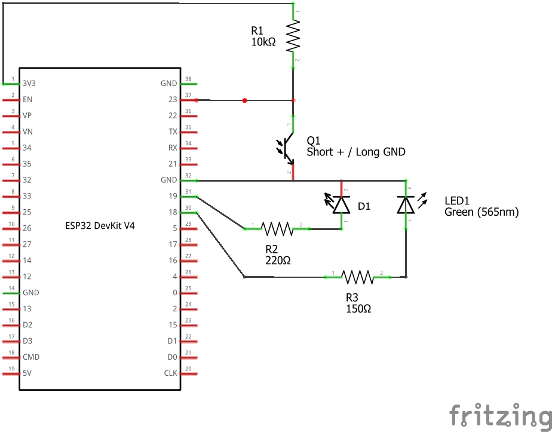
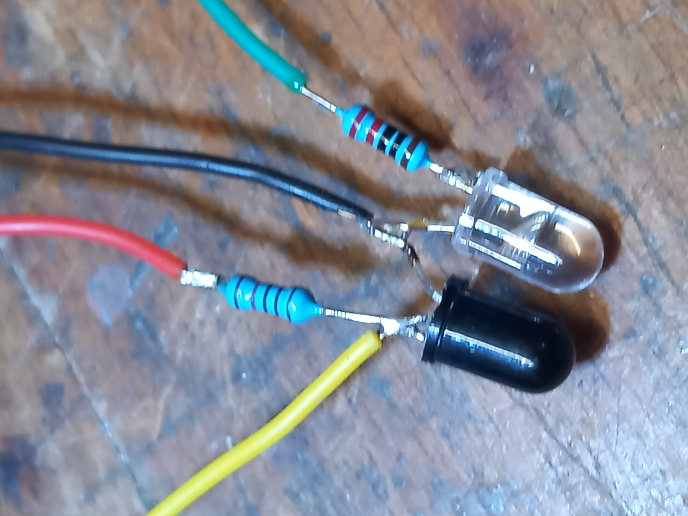
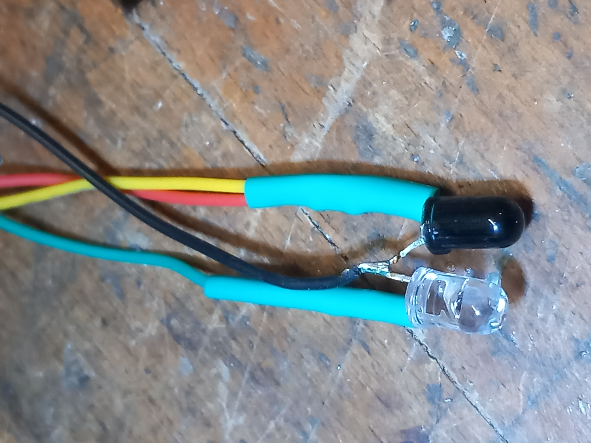
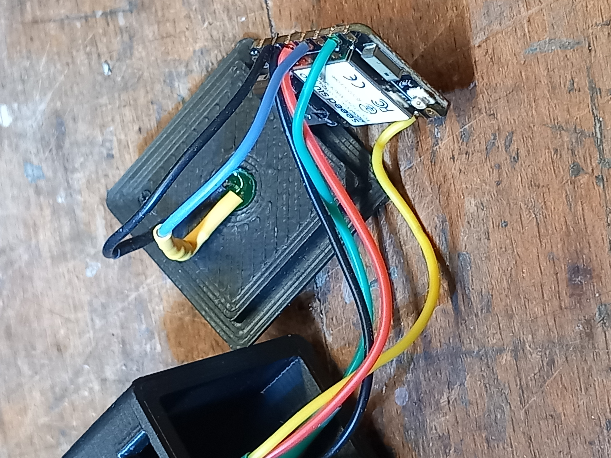
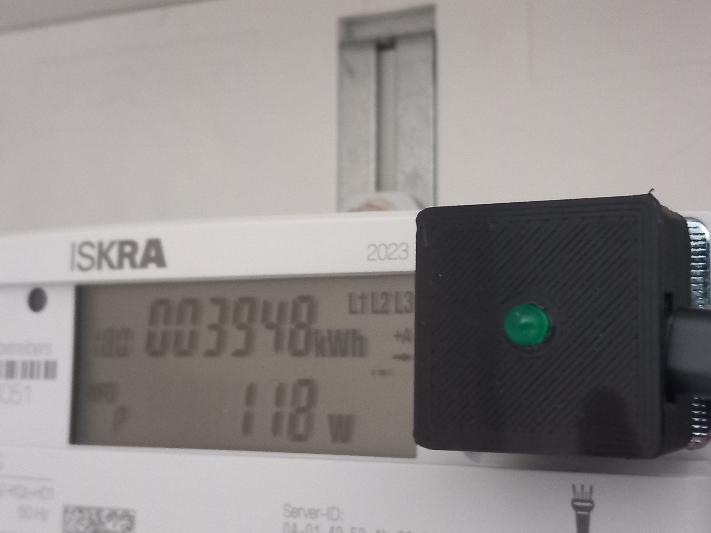

# Digital Energy Meter Sensor
This directory contains code to read data from a Digital energy meter that sends consumption data via IR-signal. 

The code is designed to run on a ESP32 microcontroller. In my case, I use an ESP32C6 which is available in a very small size.

The software reads the current meter reading and the current power consumption and sends these values as MQTT messages. For the meter reading, two separate counters are distinguished (typically consumption and feed-in).

The software features an OTA (Over the air) update by subscribing to MQTT messages for new firmware versions. For more details also see [Patterns and practices](https://github.com/tschissler/SmartHomeTS#unique-patterns-and-practices)

Here you can see the schematic für wiring the sensor:

The 3D models to print a case are available at [../../3DModels/SMLSensor](../../3DModels/SMLSensor).

## Troubleshooting: Only full kWh values, no instantaneous power

### Symptom
The meter sends SML data but you only see:
- Energy counters (`1-0:1.8.0`, `1-0:2.8.0`) rounded to whole kWh
- No instantaneous power (`1-0:16.7.0`)

This means the meter is running in **INFO mode** (limited interface). Full mode adds instantaneous power and energy values with 3 decimal places.

### Root cause
ISKRA MT631 meters (and likely other FNN Basiszähler) ship with the extended data interface (`Inf`) switched **OFF** by default. The setting also resets to OFF after every power outage. The firmware detects INFO mode automatically on each boot and attempts to activate full mode via the IR LED.

> **Important:** The activation sequence described here and implemented in the firmware was tested exclusively with the **ISKRA MT631 (variants B1T, E1T)**. The exact timing and step sequence will almost certainly differ on other meter models. Do **not** blindly apply this to other meters — you risk accidentally clearing historical data or changing unintended settings.

### How the ISKRA MT631 optical interface works
The meter has an optical sensor on the front panel. It accepts light pulses (e.g. from a flashlight or IR LED) to navigate a menu and change settings. The firmware uses the IR transmit LED to send these pulses automatically.

**Pulse types:**
- **Short pulse (1s ON):** advances one step in the menu, or counts one unit for PIN digit entry
- **Long pulse (5s ON):** activates/toggles the currently shown setting

### Full activation sequence (ISKRA MT631 only)

| Step | Action | What happens on meter display |
|------|---------|-------------------------------|
| 1 | 1s pulse | Display activates, PIN input field appears |
| 2 | Wait 5s | PIN field ready |
| 3 | N × 1s pulses per digit, 3s gap between digits | PIN digits counted up and confirmed |
| 4 | Wait 5s | Meter shows post-PIN data screen |
| 5 | 1s pulse | Meter navigates to `Inf oFF` / `Inf on` screen |
| 6 | 5s hold | `Inf` toggles (OFF → ON or ON → OFF) |
| 7 | 1s pulse | Confirm |
| 8 | 1s pulse | Confirm / return to start display |

> After step 6 activates `Inf ON`, steps 7–8 confirm and exit. Do **not** skip the two confirm pulses — the meter will not apply the setting without them.

> A 1s pulse on the `Inf` screen toggles the setting (ON → OFF), so sending an extra pulse after activation will immediately undo it.

### PIN
The PIN is a 4-digit number obtained from your grid operator (Messstellenbetreiber) in writing. For ISKRA MT631, each digit is entered by sending N short pulses (e.g. digit 3 = 3 × 1s pulses). The meter auto-advances to the next digit field after a ~3s pause with no pulse.

The PIN is configured via the `METER_PINS` environment variable (format: `serialhex:pin`, e.g. `0A0149534B00055D3343:3615`). The meter serial is printed to the serial console on first boot when INFO mode is detected.

### Inf resets on power outage
`Inf ON` is **not** preserved across power outages — the meter always resets to INFO mode when power is restored. Because the meter and sensor PCB share the same supply, the firmware re-runs the full activation sequence automatically on every boot when it detects INFO mode. The PIN itself can be permanently disabled via the meter menu (hold 5s on the `PIn` screen) to simplify repeated activation, but the `Inf` setting must always be re-applied after a power cycle.

### Testing the IR LED
If activation is not working, first verify the IR LED is functioning by checking with a smartphone camera (most cameras can see 940nm IR light). The LED should appear as a bright purple/white flash. Recommended distance from the LED to the optical sensor on the meter: **~5cm**. Strong ambient light sources (e.g. fluorescent tubes above the meter cabinet) can interfere with detection.

The visible status LED on the back of the sensor replicates every IR pulse exactly — wake-up, PIN digits, navigation, and the 5s activation hold are all mirrored as visible blinks. You can follow the entire sequence with the naked eye without needing a smartphone camera or serial monitor.

## Building the sensor hardware

