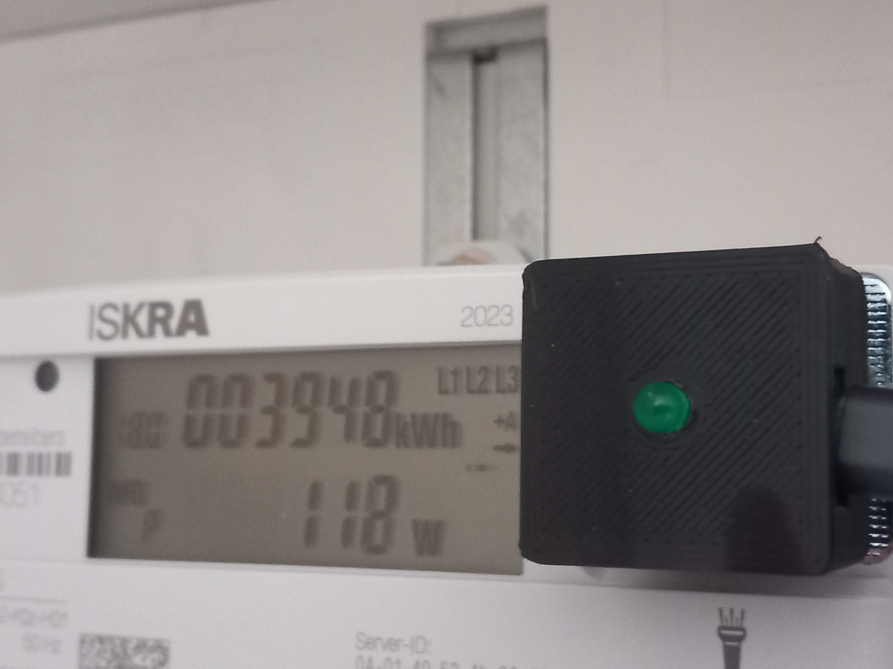

# Digital Energy Meter Sensor
This directory contains code to read data from a Digital energy meter that sends consumption data via IR-signal. 

The code is designed to run on a ESP32 microcontroller. In my case, I use an ESP32C6 which is available in a very small size.

The software reads the current meter reading and the current power consumption and sends these values as MQTT messages. For the meter reading, two separate counters are distinguished (typically consumption and feed-in).

The software features an OTA (Over the air) update by subscribing to MQTT messages for new firmware versions. For more details also see [Patterns and practices](https://github.com/tschissler/SmartHomeTS#unique-patterns-and-practices)

Here you can see the schematic für wiring the sensor:

The 3D models to print a case are available at [../../3DModels/SMLSensor](../../3DModels/SMLSensor).

## Building the sensor hardware

