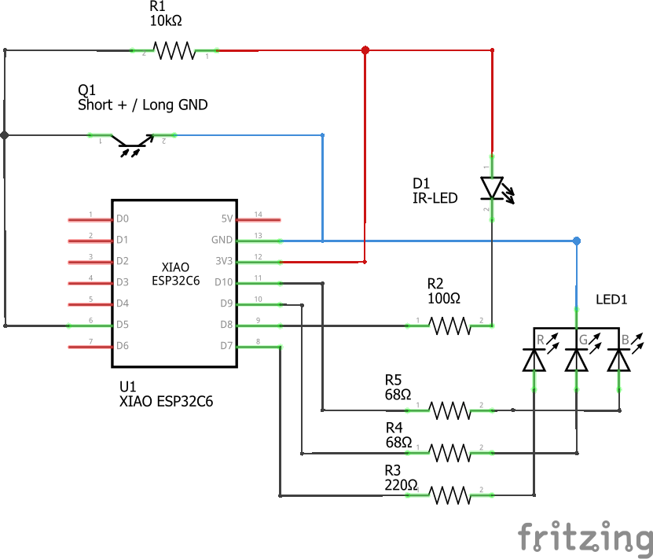

# Digital Energy Meter Sensor
This directory contains code to read data from a Digital energy sensor that sends consumption data via IR-signal. 

The code is designed to run on a ESP32 microcontroller. In my case, I use an ESP32C6 which is available in a very small size.

The software reads the current meter reading and the current power consumption. For the meter reading, two separate counters are distinguished (typically consumption and feed-in).

Here you can see the schematic für wiring the sensor:

The 3D models to print a case are available at [../../3DModels/SMLSensor](../../3DModels/SMLSensor).

## Building the sensor hardware

