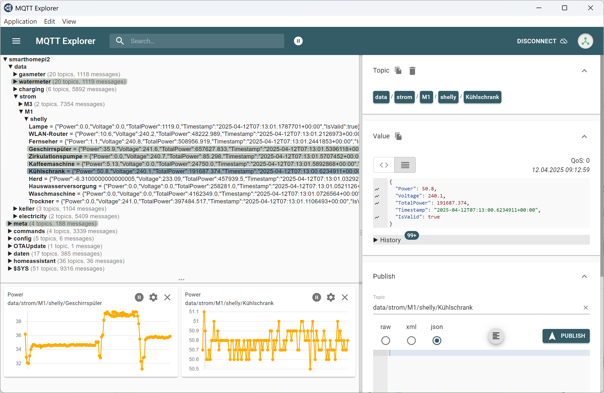
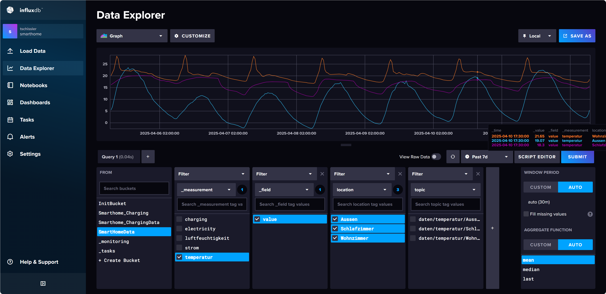
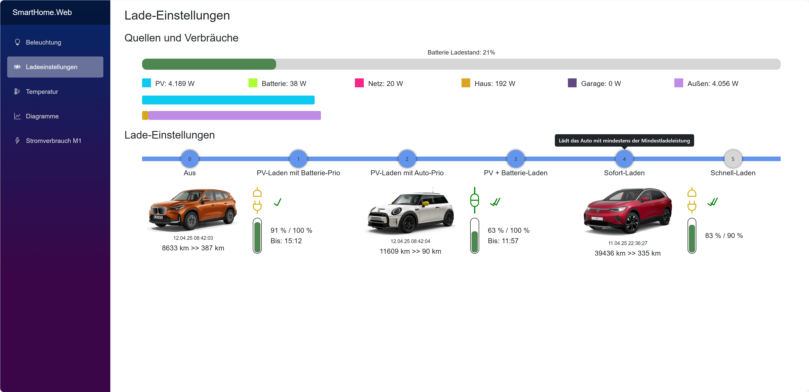

# SmartHomeTS - A Comprehensive Playground for Smart Energy Technologies

This repository documents a comprehensive smart home automation system that has been running in production for a couple of years. It serves dual purposes: managing actual home infrastructure (energy, climate, light) and providing a real-world test environment for exploring modern software development practices, architectural patterns, and emerging technologies.

## Purpose

The primary goal of this repository is to:

- Optimize energy consumption through automation and visualization.
- Add useful and fun gadgets to enhance the smart home experience.
- Experiment with and learn about diverse technologies in a practical setting.
- Test software in production to identify and address long-term issues.

While the code is tailored specifically to my equipment, devices, and needs, it is shared here to inspire others. Feel free to explore, copy, and adapt anything you find useful.

## Currently Implemented Functionality

The current state of my SmartHome system covers these capabilities:

- **[Energy Monitoring](https://github.com/tschissler/SmartHomeTS/tree/main?tab=readme-ov-file#smlsensorfirmware)**: Smart meter integration via SML protocol for real-time consumption/feed-in data
- **Water Management**: Ultrasonic cistern level monitoring with trend analysis
- **Environmental Sensing**: Multi-zone temperature and humidity monitoring with ESP32 sensors
- **EV Charging Optimization**: Automated charging control based on solar production and energy pricing
- **Vehicle Integration**: Real-time data from BMW/Mini Connected Drive and VW Connect APIs
- **Solar Production**: Live monitoring of Enphase microinverter system performance
- **Lighting Control**: RGB LED strip automation and customizable lighting scenes
- **Smart Device Integration**: Energy consumption tracking via Shelly smart switches
- **[Room temperature / thermostat control](https://github.com/tschissler/SmartHomeTS/tree/main?tab=readme-ov-file#temperature-display)**: Allowing users to set temperature targets per room

## Technologies Used

This repository showcases a variety of cutting-edge technologies, each solving specific problems and offering opportunities for learning:

- **.NET**: A powerful framework for building scalable backend services. In this repository, it powers projects like the various services and the SmartHome.Web frontend, demonstrating how to create high-performance applications with strong type safety and modularity. Learn more at [.NET Documentation](https://learn.microsoft.com/en-us/dotnet/).
- **Python**: Known for its simplicity and versatility, Python is used in the BMWConnector to integrate with BMW/Mini Connected services and VWConnector to consume the VW Connect API. These projects demonstrate how to use existing libraries and create MQTT messages based on the data. Learn more at [Python.org](https://www.python.org/).
- **C/C++**: Essential for low-level programming, these languages are used in ESP32 firmware to control IoT devices like sensors and actuators. This demonstrates how to build efficient and reliable embedded systems. Learn more at [C++ Documentation](https://cplusplus.com/) and [C Programming](https://en.cppreference.com/w/).
- **PlatformIO**: A professional collaborative platform for embedded development fully integrated with VS Code. It is used in the ESP32Firmwares projects to simplify the development and deployment (flashing) of firmware for IoT devices. Learn more at [PlatformIO](https://platformio.org/).
- **MQTT**: A lightweight messaging protocol ideal for IoT. It enables seamless communication between devices and services. Switching from REST API calls to MQTT made the solution much more robust and resilient by reducing direct dependencies. Learn more at [MQTT.org](https://mqtt.org/).

- **SML - Smart Meter Language Protocol**: A protocol used by smart meters to communicate data. Currently the SML protocol is used in the [SMLSensor project](https://github.com/tschissler/SmartHomeTS/tree/main/ESP32Firmwares/SMLSensor.Firmware) to read SML data via IR signals and send these values as MQTT messages.
- **InfluxDB**: A time-series database optimized for storing and querying time-stamped data. This repository uses InfluxDB to manage energy consumption and climate metrics, showcasing its power in data analytics. Learn more at [InfluxDB Documentation](https://docs.influxdata.com/).
- **Model Context Protocol (MCP)**: A protocol for AI tools that allows structured retrieval and manipulation of data. This repository features a C# MCP server for InfluxDB, enabling AI assistants to directly query schema and sample data to provide better assistance in creating Flux queries. Learn more at [Model Context Protocol](https://github.com/microsoft/node-model-context-protocol).
- **Kubernetes**: A container orchestration platform that ensures scalability and reliability. Kubernetes is used across multiple projects to manage containerized applications, making it essential for modern DevOps. Learn more at [Kubernetes.io](https://kubernetes.io/). In this project I use [microk8s](https://microk8s.io/) to host a Kubernetes cluster on a set of Raspberry Pis.
- **Docker**: Simplifies application deployment by containerizing services. Container images are built during the build process and then used to deploy to the kubernetes cluster. Learn more at [Docker Documentation](https://docs.docker.com/).
- **Flutter**: A cross-platform framework for building mobile apps. The Smarthome_app project illustrates how to use Flutter to build apps that run on mobile devices, Windows and in the browser. Learn more at [Flutter.dev](https://flutter.dev/).
- **Blazor**: A web framework for building interactive applications using C#. The SmartHome.Web project is an example of how to create responsive and feature-rich web interfaces. Learn more at [Blazor Documentation](https://learn.microsoft.com/en-us/aspnet/core/blazor/).
- **Syncfusion**: Provides UI components for creating interactive and visually appealing applications. Used in SmartHome.Web, it demonstrates how to enhance user interfaces with minimal effort. Learn more at [Syncfusion Blazor Components](https://www.syncfusion.com/blazor-components).

## Project Components Overview

> **Note**: Not all of these projects are actively maintained. Some have been replaced by other solutions and are kept for documentation purposes. See the Legacy/Deprecated Projects section for these projects.

### 3DModels

- **Purpose**: Contains 3D models for various cases and module boxes.
- **Inspiration**: Learn how to design and 3D print custom enclosures for your IoT projects using [OpenSCAD](https://openscad.org/).

### BMWConnector

- **Purpose**: Integrates with BMW/Mini Connected services to fetch vehicle data, such as battery status and charging information, and publishes it as MQTT messages.
- **Inspiration**: Explore how to use Python for API integration and real-time data processing.
- **Kubernetes Secrets Usage**: The BMWConnector securely manages OAuth tokens using Kubernetes Secrets. Tokens are loaded from secrets during authentication and updated periodically to ensure validity. This approach automates token management, reduces manual intervention, and enhances security by avoiding hardcoding sensitive information.

### VWConnector

- **Purpose**: Integrates with Volkswagen Connect services to fetch vehicle data from VW/Audi/Skoda vehicles, including battery status, charging information, and vehicle location, and publishes it as MQTT messages.
- **Inspiration**: Learn how to work with different automotive APIs and handle vehicle data from multiple manufacturers using the CarConnect library.

### ChargingController

- **Purpose**: Manages electric vehicle charging processes, optimizing energy usage based on availability and demand.
- **Inspiration**: Learn how to automate decision-making based on various data sources. This project also demonstrates how to use data-driven unit tests using an Excel sheet as a data source.

### KebaConnector

- **Purpose**: Integrates with KEBA KeContact wallboxes to monitor and control EV charging sessions, collecting real-time data about power consumption and charging status.
- **Inspiration**: Explore how to communicate with industrial charging equipment using UDP protocols and integrate hardware-specific APIs.

### SmartHome.DataHub

- **Purpose**: A centralized data hub service that processes and routes data between various smart home components and InfluxDB, serving as a bridge for data transformation and storage.
- **Inspiration**: Learn how to build scalable data processing services using .NET and implement data pipeline architectures.

### EnphaseConnector

- **Purpose**: Connects to Enphase solar systems to retrieve live data and control solar energy usage.
- **Inspiration**: Understand how to integrate renewable energy systems into a smart home.

### ESP32Firmwares

- **Purpose**: Firmware for ESP32-based devices, including LED strips, temperature sensors, and more.
- **Inspiration**: Learn how to program microcontrollers for IoT applications.

#### SMLSensor.Firmware

- **Purpose**: Reading data from a digital energy meter using the SML (Smart Meter Language) protocol. This repo also features instructions on how to build the hardware for the sensor.

https://github.com/user-attachments/assets/b4d1377a-9b22-4791-b81c-11fe2fb45030

For more details see [ESP32Firmwares/SMLSensor.Firmware#readme](ESP32Firmwares/SMLSensor.Firmware#readme)

#### Temperature Display

- **Purpose**: This project allows control of room temperatures by viewing and changing thermostat settings. The display integrates fully via MQTT as it receives all data to be displayed by subscribing to various MQTT topics and sending changes to the thermostat settings as MQTT messages. These MQTT messages are then picked up by the [ShellyConnector](https://github.com/tschissler/SmartHomeTS/tree/main?tab=readme-ov-file#shellyconnector) and used to define the target temperature for these devices.

- **Inspiration**: Learn how to build a visual interface controlled by touch gestures.
  
- **Details**:
  
  - The display is built with this device: [WaveShare ESP32-S3-Touch-LCD-7](https://www.waveshare.com/wiki/ESP32-S3-Touch-LCD-7).
  - It uses the [LVGL library](https://github.com/lvgl/lvgl). The UI is designed using [SquareLine Studio](https://squareline.io/).


### MCPServer

- **Purpose**: Provides a structured interface for AI tools to query and analyze InfluxDB time-series data through the Model Context Protocol (MCP).
- **Inspiration**: Learn how to build MCP servers in C# that enable AI assistants to work directly with time-series databases.
- **Usage**:
  1. Configure the server in `.vscode/mcp.json` to register it with VS Code:

     ```json
     {
       "servers": [
         {
           "id": "csharp-influxdb-server",
           "name": "C# InfluxDB MCP Server",
           "command": "dotnet",
           "args": ["run", "--project", "${workspaceFolder}/MCPServer/MCPServer.csproj"],
           "transport": "stdio",
           "supportsDynamicRegistration": true
         }
       ]
     }
     ```

  2. Set environment variables for InfluxDB connection:
     - `INFLUXDB_URL`: The URL of your InfluxDB instance (default: "<http://localhost:8086>")
     - `INFLUXDB_TOKEN`: Your InfluxDB authentication token
     - `INFLUXDB_ORG`: Your InfluxDB organization name (default: "SmartHome")
  3. Use the MCP tools to query InfluxDB data:
     - `GetSchema`: Retrieve the complete schema of your InfluxDB instance
     - `GetBuckets`: List all available buckets
     - `GetMeasurements`: Get all measurements in a specific bucket
     - `GetFields`: Get all field keys for a given measurement
     - `GetTags`: Get all tag keys for a measurement
     - `GetSample`: Get sample data from a measurement
     - And other utilities for time range analysis and field type inspection

### Influx

- **Purpose**: Manages InfluxDB for storing and querying time-series data, such as energy consumption and climate metrics.
- **Inspiration**: See how to use time-series databases for advanced data analytics.


### Grafana

- **Purpose**: Provides visualization and monitoring dashboards for the smart home system, creating interactive charts and graphs from InfluxDB time-series data.
- **Inspiration**: Learn how to deploy Grafana in Kubernetes and create compelling data visualizations for real-time monitoring.

### Smarthome.App.MAUI

- **Purpose**: A cross-platform mobile app for managing the smart home system, providing a user-friendly interface for monitoring and control.
- **Inspiration**: Discover how to create mobile apps with real-time data visualization.

### SmartHome.Web

- **Purpose**: A web interface for visualizing and controlling the smart home system, offering a centralized dashboard.
- **Inspiration**: Learn how to build interactive web applications with Blazor and Syncfusion.


### ShellyConnector

- **Purpose**: Integrates with Shelly smart devices, enabling control and monitoring of connected appliances.
- **Inspiration**: Explore how to connect and manage smart devices using MQTT.

### Thermostat

- **Purpose**: A dedicated thermostat service that controls heating and cooling systems by interfacing with Shelly devices and publishing temperature control commands via MQTT.
- **Inspiration**: Learn how to build IoT control systems that integrate multiple hardware components for automated climate management.

## Legacy/Deprecated Projects

> **📚 Note**: These projects are no longer actively maintained but are kept in the repository for documentation and learning purposes. They showcase the evolution of the smart home system and demonstrate different approaches that have been superseded by newer solutions.

### DataAggregator

- **Purpose**: Previously aggregated and processed data from various sources, providing a unified view of the smart home system.
- **Inspiration**: Demonstrates how to create modular and testable data processing pipelines.
- **Status**: Replaced by InfluxDB's native data aggregation capabilities.

### PowerDogConnector

- **Purpose**: Previously integrated with PowerDog energy monitoring devices to collect power consumption data and publish it as MQTT messages.
- **Inspiration**: Shows how to work with legacy energy monitoring hardware and protocol integration.
- **Status**: Fully replaced by EnphaseConnector, which provides more comprehensive solar system monitoring.

### MQTTBroker

- **Purpose**: Previously provided a custom MQTT broker implementation for communication between devices and services.
- **Inspiration**: Demonstrates how to build custom messaging infrastructure and understand MQTT protocol internals.
- **Status**: Replaced by [Mosquitto](https://mosquitto.org/), which provides a more robust and feature-complete MQTT broker solution.

### ESP32NF

- **Purpose**: Previously contained experimental projects using .NET nanoFramework on ESP32 devices, including the KellerDevice project for water level monitoring.
- **Inspiration**: Demonstrates how to use C# and .NET on microcontrollers, exploring the possibilities of bringing familiar development paradigms to embedded systems.
- **Status**: Deprecated in favor of traditional C/C++ ESP32 firmware development for better performance and OTA update capaility.

## Tools Frequently Used

While working with this repository, the following tools are frequently utilized to enhance productivity and streamline development:

- **VSCode**: A lightweight and versatile code editor, ideal for quick edits and exploring the codebase. Extensions like PlatformIO and Docker make it a powerful tool for embedded and containerized development.
- **Visual Studio**: Used for developing and debugging .NET projects like ChargingController and SmartHome.DataHub. Its robust debugging tools and integration with Azure DevOps make it indispensable for large-scale projects.
- **MQTT Explorer**: A graphical MQTT client that simplifies the process of monitoring and debugging MQTT topics and messages. It is particularly useful for projects like MQTTBroker and ShellyConnector.
- **OpenSCAD**: A script-based 3D CAD modeler that is used for creating precise 3D models, such as the sensor cases and module boxes in the `3DModels` directory. It allows for parametric design, making it easy to adjust dimensions and features programmatically. Learn more at [OpenSCAD](https://openscad.org/).

## Kubernetes Secrets Usage

Kubernetes secrets are used in this repository to securely manage sensitive information such as API keys, credentials, and certificates.

You can see one example in the BMWConnector project as it uses Kubernetes Secrets for securely managing OAuth tokens required for authenticating with the BMW Connected Drive API. Here's how it works:

1. **Loading Secrets**:
   - The `load_oauth_store_from_k8s_secret` function in k8s_utils.py reads OAuth tokens from a Kubernetes Secret. It decodes the base64-encoded values and sets them in the `MyBMWAccount` object for authentication.

2. **Storing Secrets**:
   - The `store_oauth_store_to_k8s_secret` function updates or creates a Kubernetes Secret with the latest OAuth tokens. It encodes the tokens in base64 before storing them, ensuring secure handling of sensitive data.

3. **Integration in bmw_mqtt.py**:
   - The `connect_vehicle` function attempts to load OAuth tokens from Kubernetes Secrets for authentication. If this fails, it prompts the user for a captcha token (in interactive mode) and stores the new tokens back into the Kubernetes Secret.
   - As the secret is stored in Kubernetes as a centralized instance, the interactive providing of a captcha token can be executed on a workstation and the service running in the Kubernetes cluster can then pick up this information when running.
   - During the main loop, the script periodically refreshes the OAuth tokens and updates the Kubernetes Secret to keep the tokens valid.

This approach ensures secure and automated management of authentication tokens, reducing manual intervention and enhancing reliability.

## Unique Patterns and Practices

This repository showcases several patterns and practices that enhance its functionality and maintainability:

- **ESP32 Firmware Patterns**:
  - **OTA Updates**: Over-the-air update mechanisms are implemented for seamless firmware upgrades. In this example, the GitHub Actions pipeline builds a new firmware and publishes it to Blob storage. Then it sends out an MQTT message with the new firmware location and version. The ESP32 devices are subscribed to this message and check if they are running the latest version. If not, they execute an OTA update. As the MQTT message is retained, devices will be updated even if they were offline during the pipeline run as soon as they come online after that.

## Hosting and CI/CD

This project is hosted on **GitHub**, leveraging its robust ecosystem for version control, collaboration, and automation. The repository uses **GitHub Actions** for Continuous Integration and Continuous Deployment (CI/CD), ensuring a streamlined and automated development workflow.

### CI/CD Highlights

- **GitHub Actions**: Workflows are defined to automate testing, building, and deploying the projects. These workflows ensure that every change is validated and deployed efficiently.
- **Kubernetes Agent**: A custom agent runs on the Kubernetes cluster, enabling automated deployments directly from GitHub Actions. This integration ensures that updates are deployed seamlessly to the cluster.

These workflows are designed to provide a robust and automated pipeline, reducing manual effort and ensuring consistent deployments.

## External Resources

- [bimmer_connected Documentation](https://bimmer-connected.readthedocs.io/): For BMW/Mini car integration.
- [CarConnect](https://github.com/tillsteinbach/CarConnectivity): For VW car integration.
- [Syncfusion Blazor Components](https://www.syncfusion.com/blazor-components): UI components for Blazor.
- [InfluxDB Documentation](https://docs.influxdata.com/): For time-series data management.
- [MQTT Protocol](https://mqtt.org/): Lightweight messaging protocol for IoT.
- [PlatformIO Documentation](https://docs.platformio.org/): Embedded development platform.

This repository is a work in progress and is tailored to my specific needs. However, it is shared with the hope that it provides inspiration and learning opportunities for others interested in smart home technologies.
